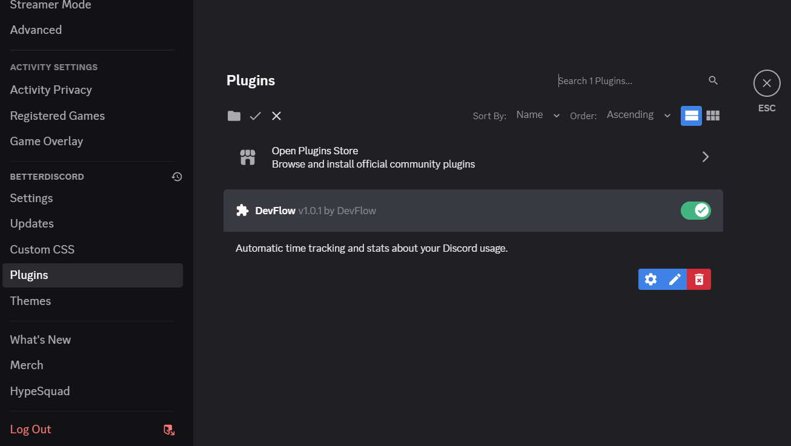

# DevFlow for Discord

DevFlow is a fork of the original [WakaTime][wakatime] Discord plugin, providing metrics, insights, and time tracking automatically generated from your programming activity.

## Installation

1. Install [BetterDiscord](https://betterdiscord.app/)

    Note: BetterDiscord is not affiliated with Discord. Please read their [FAQ](https://docs.betterdiscord.app/users/getting-started/faq) for more information.

2. Download the [latest release](https://github.com/maherDEV-IE/devflow-discord/releases/latest)

3. Move `devflow-discord.plugin.js` to [your plugin folder](https://docs.betterdiscord.app/plugins/introduction/quick-start#plugin-folder)

4. Enable the DevFlow plugin in BetterDiscord’s plugin settings
    

5. Enter your [api key][api key] in the DevFlow plugin’s settings

6. Use Discord and your activity will be displayed on your [WakaTime dashboard](https://wakatime.com)

## Usage

Visit [https://wakatime.com](https://wakatime.com) to see your activity.

[wakatime]: https://wakatime.com/discord
[api key]: https://wakatime.com/api-key
